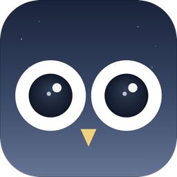

<div align="center">
  
  <h1>miniowl</h1>
  <p><strong>A tiny, privacy-first macOS activity tracker that lives in your menu bar.</strong></p>
  <p>~1,500 lines of Swift · zero dependencies · plain JSONL files · no network</p>
  <p>
    
    
    
    
  </p>
</div>

---

## What it is

miniowl is a small macOS app that quietly records which application has focus, what its window title is, when you're at the keyboard versus away, and (for whitelisted browsers) the URL of your current tab. It writes everything to a plain JSON-Lines file under `~/Library/Application Support/miniowl/`. Nothing leaves your Mac. The whole source tree is around 1,500 lines of Swift you can read in one sitting.

It exists because **the only honest way to know where your time goes is to measure it**. Self-reports are flattering and inaccurate. Calendars are aspirational. miniowl just records what actually happened.

## Why you might want it

- You want to answer "where did the week go?" with data instead of memory.
- You're trying to escape a productivity trap (e.g. shipping code when you should be talking to users) and need to see your time honestly.
- You don't want a SaaS time tracker reading your screen, syncing to a server, or showing you a dashboard designed to keep you engaged.
- You want a small, single-binary tool you can audit, fork, and modify in an afternoon.

If those don't resonate, you probably want something else — RescueTime, Toggl, Timing, or ActivityWatch are all good. miniowl is deliberately the opposite of "fully featured."

## Privacy contract

These are **code-enforced** invariants. The build fails if any banned API appears in the source tree (see [`scripts/check-privacy.sh`](scripts/check-privacy.sh) and [`Sources/miniowl/Privacy/ForbiddenImports.swift`](Sources/miniowl/Privacy/ForbiddenImports.swift)).

| miniowl can read | miniowl cannot read |
|---|---|
| Frontmost app name + bundle ID | Keystrokes (no `CGEventTap`, no global event monitors) |
| Title of the focused window (via the Accessibility API) | Clipboard contents (no `NSPasteboard`) |
| One number: seconds since last input | Screen pixels (no `CGWindowListCreateImage`, no `ScreenCaptureKit`) |
| Browser current-tab URL via AppleScript (whitelisted browsers only) | Page content, form data, browsing history |
| `NSWorkspace` notifications: sleep / wake / lock / unlock | Anything over the network — Phase 1 has zero `URLSession` |

The audit surface is small enough that a skeptic can read every line of Swift in under an hour and verify these claims.

## Features

- **App + window title** capture via `NSWorkspace` activation events and the Accessibility API
- **Browser URL** capture for Chrome, Safari, Arc, and Brave via pre-compiled AppleScript
- **AFK detection** via `CGEventSource.secondsSinceLastEventType` (one integer, no event taps)
- **Sleep / wake / lock** events via `NSWorkspace` notifications
- **Live menu bar popover** with today's top apps + AFK total, refreshed every 30 s
- **Pause / resume** with honest `paused` / `resumed` markers in the data
- **Auto-launch at login** via `SMAppService.mainApp`
- **Daily rotation + gzip**: today's file is plain JSONL, older days get compressed at midnight
- **Crash recovery** via a 10 s heartbeat to `state.json` — at most 10 seconds of pending work is lost on `kill -9`
- **Compact storage**: ~5–8 KB per day gzipped, ~10–15 MB for five years
- **Zero third-party dependencies** — only Foundation, AppKit, ApplicationServices, ServiceManagement, SwiftUI

## Screenshots

<div align="center">
  <p><em>(menu bar popover — click the eye icon)</em></p>
</div>

```
┌─────────────────────────────────┐
│ ●  miniowl  ·  Tracking         │
├─────────────────────────────────┤
│ Today                            │
│  IntelliJ IDEA          2h 14m  │
│  Google Chrome          1h 03m  │
│  Preview                  45m   │
│  Slack                    28m   │
│  Terminal                 12m   │
│  — AFK                    37m   │
├─────────────────────────────────┤
│ Pause tracking          ⌘P      │
│ Open data folder                │
│ Quit miniowl            ⌘Q      │
└─────────────────────────────────┘
```

## Install

### Requirements

- macOS 14 (Sonoma) or later
- Swift 5.9+ (ships with Xcode 15+, or install via [swift.org](https://www.swift.org/install/macos/)). On a stock Mac without Xcode, you can install just the Command Line Tools with `xcode-select --install`.

### Build from source

```bash
git clone https://github.com/journelyme/miniowl.git
cd miniowl
./scripts/build-app.sh
```

This produces `build/miniowl.app` (~400 KB). Then install it the standard way:

```bash
cp -R build/miniowl.app /Applications/
open /Applications/miniowl.app
```

`miniowl` appears as an eye icon in your menu bar (top-right of the screen).

## First-run permissions

macOS will ask for two permissions on the first launch. Both are required for the features to work but **neither lets miniowl read content** — see the [privacy contract](#privacy-contract) above for what each one actually allows.

### 1. Accessibility (required for window titles)

1. Click the eye icon in the menu bar — the popover will say "Accessibility permission required"
2. Click **Open Settings**
3. In **System Settings → Privacy & Security → Accessibility**, click the **+** button, navigate to `/Applications/miniowl.app`, and add it
4. Toggle the new `miniowl` entry **on**
5. Click the menu bar icon again — the banner should clear within ~1 second

If the banner stays after granting, click **Restart miniowl** in the same banner. This is a known macOS quirk with newly signed binaries — see [Limitations](#limitations--known-issues) below.

### 2. Automation (per browser, required for URL tracking)

The first time you focus Chrome, Safari, Arc, or Brave after granting Accessibility, macOS will show:

> "miniowl" wants to control "Google Chrome". Allowing control will provide access to documents and data in "Google Chrome", and to perform actions within that app.

Click **OK**. miniowl uses this only to read the URL of the active tab via AppleScript — it never reads page content, form data, or other tabs. Each browser prompts independently the first time it gains focus.

### 3. Login items (so miniowl auto-starts at login)

miniowl calls `SMAppService.mainApp.register()` on first launch. macOS may show a prompt; you can also verify (or toggle) it manually under **System Settings → General → Login Items & Extensions → Open at Login**.

## Querying your data

There is no dashboard, by design. Today's data lives at `~/Library/Application Support/miniowl/YYYY-MM-DD.mow` and older days at `YYYY-MM-DD.mow.gz`. Use the canned report script or your own `jq` recipes.

```bash
# Top apps by active time today
./scripts/query-today.sh
```

Sample output:

```
miniowl — 2026-04-10
─────────────────────────────────────

Top apps by active time

  142.3m  IntelliJ IDEA
   63.1m  Google Chrome
   45.0m  Preview
   28.4m  Slack
    9.2m  Terminal

AFK:           37.2 min

System markers
  09:02:11  launch
  10:14:33  sleep
  10:38:02  wake
  ...
```

### Custom queries

The data is plain JSON-Lines. Anything that reads text can query it. The schema lives in [the Data format section](#data-format) below.

```bash
DATA="$HOME/Library/Application Support/miniowl"
TODAY=$(date +%F)

# Total time in IntelliJ today
jq -r 'select(.t=="w" and .b=="com.jetbrains.intellij") | .e - .s' "$DATA/$TODAY.mow" \
  | awk '{s+=$1} END {printf "%.1fh\n", s/3600000}'

# Top URLs visited in Chrome today
jq -r 'select(.t=="w" and .b=="com.google.Chrome" and .u != null) | "\(.e-.s)\t\(.u)"' "$DATA/$TODAY.mow" \
  | awk -F'\t' '{sum[$2]+=$1} END {for(k in sum) printf "%4.0fs  %s\n", sum[k]/1000, k}' \
  | sort -rn | head -10

# How much "coding time" (your favorite IDEs/terminals) vs "talking time"
# (Slack/Zoom/Meet) so far this month
for f in "$DATA"/$(date +%Y-%m)-*.mow*; do
  case "$f" in *.gz) gunzip -c "$f" ;; *) cat "$f" ;; esac
done | jq -r 'select(.t=="w") | "\(.e-.s)\t\(.b)"' \
  | awk -F'\t' '
      /jetbrains|iTerm|Terminal|VSCode/ {code += $1}
      /slack|zoom|Meet|Messages|Discord/ {talk += $1}
      END {printf "code: %5.1fh\ntalk: %5.1fh\n", code/3600000, talk/3600000}'
```

## Data format

Each day gets one file: `YYYY-MM-DD.mow`. It's plain JSON-Lines — you can `cat`, `tail -f`, `jq`, or `grep` it. At local midnight the file is gzipped (`.mow.gz`) and a new one is opened.

### Header (line 1)

```json
{"d":"2026-04-10","start":1712707200000,"tz":"Asia/Tokyo","v":1}
```

| Key | Meaning |
|---|---|
| `v` | Format version. Bumped on breaking changes. |
| `d` | Local calendar date for this file. |
| `tz` | IANA time zone at rotation time. |
| `start` | Unix milliseconds at which this file was opened. |

### Event lines

Single-character keys to keep the uncompressed file small (gzip mostly erases the difference, but the raw file is also useful in flight).

#### Window event — `t: "w"`

```json
{"t":"w","s":1712739600000,"e":1712739720000,"b":"com.jetbrains.intellij","n":"IntelliJ IDEA","ti":"workspace – main.go","u":null}
```

| Key | Meaning |
|---|---|
| `s` | start_ts — Unix ms UTC |
| `e` | end_ts — Unix ms UTC |
| `b` | bundle identifier |
| `n` | app display name |
| `ti` | window title (may be null for secure-input fields) |
| `u` | active tab URL (only set for whitelisted browsers; null otherwise) |

Consecutive observations with the same `(b, ti, u)` triple are merged in memory by the coordinator and written as a single row when the state changes.

#### AFK event — `t: "a"`

```json
{"t":"a","s":1712739900000,"e":1712740080000,"k":1}
```

| Key | Meaning |
|---|---|
| `s`, `e` | Unix ms UTC start / end of the AFK interval |
| `k` | `1` = away. Only `away` intervals are written; "active" is implied as the complement. |

The threshold for "AFK" is 180 seconds of no input. Start timestamps are back-dated: if you walk away at 10:00:00 and the threshold trips at 10:03:00, the row's `s` is 10:00:00.

#### System event — `t: "s"`

```json
{"t":"s","s":1712740100000,"k":"sleep"}
```

| `k` value | Meaning |
|---|---|
| `launch` | miniowl process started |
| `quit` | miniowl process exited cleanly |
| `sleep` | system going to sleep |
| `wake` | system woke from sleep |
| `lock` | screens locked |
| `unlock` | screens unlocked |
| `paused` | tracking paused by user |
| `resumed` | tracking resumed |

### Expected disk footprint

| Period | Size (rotated + gzipped) |
|---|---|
| 1 day | 5–8 KB |
| 1 month | 150–250 KB |
| 1 year | 2–3 MB |
| 5 years | 10–15 MB |

## Architecture

```
┌────────────── miniowl (single process) ──────────────┐
│                                                       │
│  ┌─ MenuBarExtra (SwiftUI, main thread) ──────┐      │
│  │  Status · Pause/Resume · Open data folder  │      │
│  │  Today's totals · Permission state · Quit  │      │
│  └────────────────┬────────────────────────────┘      │
│                   │                                   │
│  ┌─ EventCoordinator (actor, single writer) ─┐       │
│  │  Buffers a PendingEvent in memory.         │       │
│  │  Decides when to extend / close / persist. │       │
│  │  Writes to EventLog on close or heartbeat. │       │
│  └──┬─────┬─────┬─────┬─────┬─────────────────┘      │
│     │     │     │     │     │                        │
│  ┌──▼──┐ ┌▼──┐ ┌▼───┐ ┌▼────┐                       │
│  │Win  │ │AFK│ │Sys │ │Brwsr│                       │
│  │Watch│ │   │ │Watc│ │     │                       │
│  └─────┘ └───┘ └────┘ └─────┘                        │
│                                                       │
│  ┌─ EventLog (serial JSONL writer + rotation) ─┐    │
│  │  ~/Library/Application Support/miniowl/      │    │
│  │    YYYY-MM-DD.mow      (today, plain)        │    │
│  │    YYYY-MM-DD.mow.gz   (yesterday, gzipped)  │    │
│  │    state.json          (10 s pending snap)   │    │
│  └───────────────────────────────────────────────┘    │
└───────────────────────────────────────────────────────┘
```

**One writer.** Every disk write funnels through the `EventCoordinator` actor — no races on the file handle.

**Watchers are dumb producers.** They emit raw observations; the coordinator decides whether the new observation extends the pending event in memory or closes it and opens a new one.

**Merging happens before disk.** Staying in IntelliJ on the same file for an hour writes one row, not 720.

**Crash safety.** A 10-second heartbeat mirrors the in-memory pending event to `state.json` via atomic write-then-rename. On the next launch, the coordinator recovers any stale pending into the log.

## Project layout

```
miniowl/
├── Package.swift                           # SPM manifest (Swift 5.9, macOS 14+)
├── miniowl-bundle/
│   ├── Info.plist                          # bundle metadata, LSUIElement
│   ├── miniowl.entitlements                # only automation.apple-events
│   └── AppIcon.icns                        # generated by tools/make-icon.sh
├── Sources/miniowl/
│   ├── miniowlApp.swift                    # @main + AppDelegate + signal handlers
│   ├── Coordinator/
│   │   ├── EventCoordinator.swift          # single-writer actor + merging logic
│   │   └── PendingEvent.swift              # in-memory value type
│   ├── Storage/
│   │   ├── EventLog.swift                  # JSONL append + daily gzip rotation
│   │   ├── StateFile.swift                 # atomic state.json for crash recovery
│   │   └── LogReader.swift                 # streaming JSONL → daily totals
│   ├── Watchers/
│   │   ├── WindowWatcher.swift             # NSWorkspace + Accessibility API
│   │   ├── AFKWatcher.swift                # CGEventSource idle state machine
│   │   ├── BrowserWatcher.swift            # pre-compiled AppleScript per browser
│   │   └── SystemWatcher.swift             # sleep / wake / lock notifications
│   ├── Permissions/
│   │   └── AccessibilityPermission.swift   # AX trust check + open Settings helper
│   ├── UI/
│   │   ├── AppState.swift                  # @MainActor orchestrator + timers
│   │   ├── MenuContent.swift               # popover layout
│   │   └── TodaySummary.swift              # "Today" totals row
│   └── Privacy/
│       └── ForbiddenImports.swift          # banned-symbol manifest (non-executable)
├── scripts/
│   ├── build-app.sh                        # build + bundle + ad-hoc sign
│   ├── check-privacy.sh                    # CI grep for banned APIs
│   └── query-today.sh                      # canned jq report
├── tools/
│   ├── make-icon.swift                     # render the master 1024 px PNG
│   └── make-icon.sh                        # PNG → iconset → .icns
└── assets/                                 # README icon previews
```

## Development

```bash
# Hot loop (run the binary directly, ctrl-C to stop)
swift run -c release

# Full bundled build
./scripts/build-app.sh

# Privacy check (also runs as the first step of build-app.sh)
./scripts/check-privacy.sh

# Regenerate the app icon from scratch
./tools/make-icon.sh
```

The privacy check is just a `grep` for banned API names. Banned symbols live in [`Sources/miniowl/Privacy/ForbiddenImports.swift`](Sources/miniowl/Privacy/ForbiddenImports.swift) and the script greps the rest of the source tree for them. **If you need to add a new API surface, audit it against the privacy contract first** — and please don't bypass the check.

### Adding a new watcher

1. Create `Sources/miniowl/Watchers/MyWatcher.swift` with a class that takes an `EventCoordinator` and exposes `start()`. Use a dedicated `DispatchQueue` for sampling — never the main thread.
2. Add a new `EventKind` case in `Sources/miniowl/Coordinator/PendingEvent.swift` if your data shape doesn't fit the existing `.window` or `.afk` cases.
3. Teach `EventCoordinator.encodeInterval` how to serialize it.
4. Wire the watcher into `AppState.init` and `AppState.start`.
5. Document the new event type in this README's [Data format](#data-format) section.

## Limitations & known issues

- **Ad-hoc signing breaks TCC across rebuilds.** Every `swift build` produces a new code-signature hash, and macOS Accessibility/Automation grants are tied to that hash. After rebuilding, you may need to re-grant permission via System Settings → Privacy & Security → Accessibility (remove the old `miniowl` entry with `−`, add the freshly built `/Applications/miniowl.app` with `+`). The fix is to sign with a real Apple Developer ID; left as a future improvement.
- **Spotlight does not index ad-hoc-signed apps.** You won't find miniowl via Cmd+Space — that's expected. Use the menu bar icon, or use Raycast / Alfred which have their own indexers.
- **Watching a video reads as AFK.** No mouse or keyboard input → idle counter ticks → AFK threshold trips. We don't try to fix this; the honest signal is "no input at the keyboard."
- **Rotation polls every 60 seconds.** A new day's file opens within ~60 seconds of midnight, not exactly at midnight.
- **No Phase 2 features yet** — no dashboard, no LLM categorization, no server sync, no cloud backup, no exports to other trackers, no calendar integration. These are deliberately deferred. The data format is versioned (`v: 1` in the header) so anything you build on top of it later can detect the schema.
- **Single-machine only.** No multi-device sync. If you use multiple Macs, you get one log per machine.

## Roadmap (maybe)

These are explicitly not in Phase 1. They may or may not happen depending on whether the data alone turns out to be useful.

- A small read-only viewer (HTML or SwiftUI) for past days
- LLM-based categorization of window titles into work modes
- Optional Calendar.app overlay so meetings are aligned to focus blocks
- Stable signing via a self-signed certificate generator script
- A `.dmg` release in GitHub Releases so people don't have to build from source

If you'd find any of these useful, open an issue and say so.

## Contributing

Issues and pull requests welcome. Please:

1. Run `./scripts/check-privacy.sh` before pushing — the build script does this, but it's faster to catch locally.
2. Don't add third-party dependencies. The project's whole shape is "auditable in one sitting." If you need a library, the bar is "I rewrote it twice and still got it wrong."
3. Don't add network code. Phase 1 is air-gapped.
4. Keep watchers off the main thread. AX and AppleScript calls can block for hundreds of milliseconds — main is reserved for SwiftUI.

## Acknowledgments

Inspired by [ActivityWatch](https://github.com/ActivityWatch/activitywatch). miniowl is a deliberately smaller, single-user reimagining in native Swift — none of ActivityWatch's source code is used.

## License

[MIT](LICENSE) — do what you want, no warranty, attribute if you fork for distribution.
